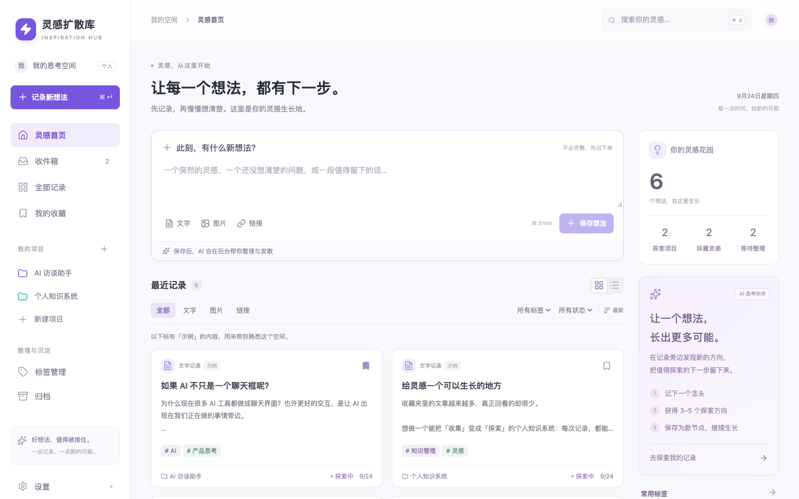
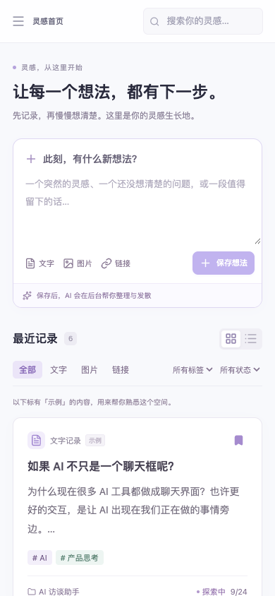
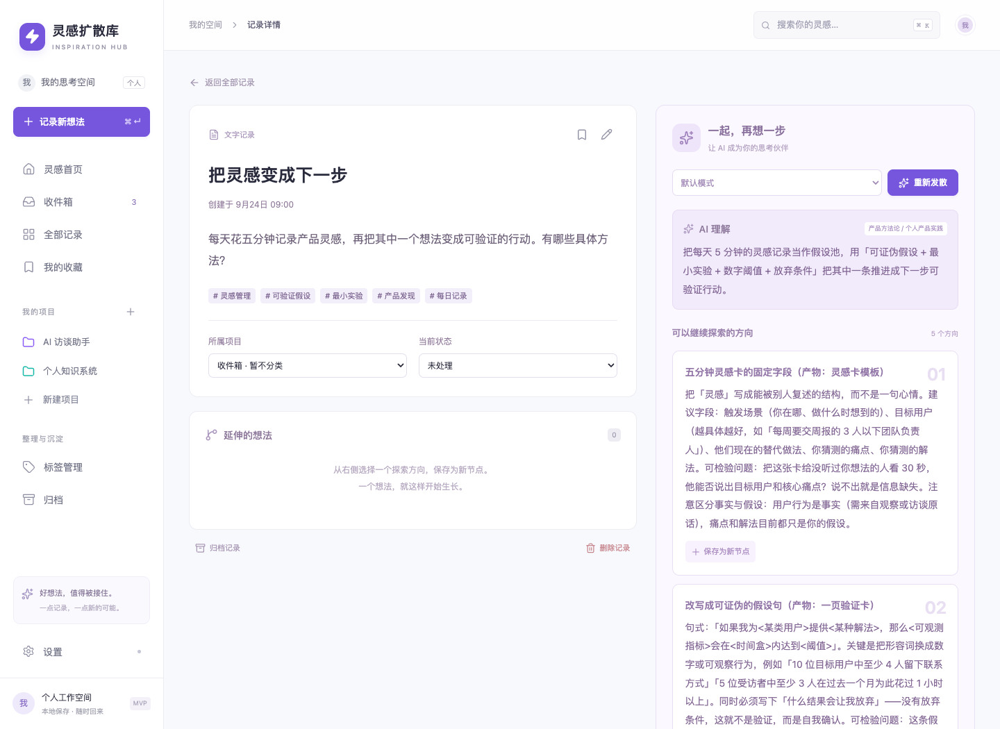

# 灵感扩散库 · AI Inspiration Hub

根据 `AI_Inspiration_Hub_PRD.md` 实现的个人 MVP，支持本地 SQLite，以及 Vercel + Supabase 云端部署。主流程：记录 → AI 理解与发散 → 保存子节点 → 项目归类 → 搜索找回。

**在线站点：**[打开灵感扩散库](https://ai-inspiration-hub.vercel.app)（个人站点，需要访问凭据）。

## 页面预览

截图使用独立的示例记录；AI 发散图中的内容由线上模型根据演示想法生成，不包含个人资料。

<table>
  <tr><th>桌面首页</th><th>手机首页</th></tr>
  <tr>
    <td></td>
    <td></td>
  </tr>
</table>

**记录详情与 AI 发散**



## 本地启动

使用 Node.js **24 LTS**（使用内置 SQLite，与 Vercel 构建版本一致）。

```sh
npm install
npm run dev
```

打开 http://127.0.0.1:3003 。默认仅监听本机。首次启动自动添加 6 条明确标记的示例记录和 2 个项目，示例不包含伪造的 AI 结果。

生产方式：

```sh
npm run build
npm start
```

## 已实现

- 文字、Markdown、图片（JPG / PNG / WEBP / GIF，10 MB 以内）、URL；支持粘贴图片及快捷键保存。
- 收件箱、项目创建/编辑/归档/删除、节点归类、手动标签、收藏、状态、归档/恢复、编辑与确认删除。删除项目会保留记录及父子关系，并将记录移回收件箱。
- 关键词搜索，组合项目/标签/状态/内容类型筛选；服务端分页，每页 18 条。
- OpenAI 兼容模型接口：摘要、关键词、分类、3–5 个发散方向与行动建议；支持默认/实用/创意/反向/产品模式。
- AI 连接测试与结构校验；分析结合记录所属项目的目标和状态。
- 数据库持久化后台任务，不阻塞记录保存；排队/运行/自动重试/失败状态、取消与手动重试。
- 发散方向和行动保存为子节点；父子跳转与行动勾选。
- 图片持久化（本地或 Supabase）；保存链接后在后台解析页面标题、描述与 OG 封面，并在列表和详情显示预览。解析失败保留原始 URL，封面读取失败时回退为链接图标。
- 本地 SQLite WAL、云端 Supabase、JSON 导出、桌面及手机布局。
- 新建想法自动保存浏览器草稿，按收件箱/项目隔离；刷新或切换页面后恢复文字、链接与已上传图片。保存失败时保留草稿，保存成功后清空。
- 含图片的完整备份、导入预览、冲突检查与合并恢复；保留已有数据，不会因恢复触发 AI 调用。

## 连接 AI

进入「设置」，填写 **API 地址、模型名称、API Key**，点击「测试连接」验证文字和 JSON 输出，再保存配置。测试发送一条简短请求，可能产生少量模型用量，且不会保存表单内容。更换服务地址时必须重新填写对应密钥，防止将旧服务的密钥发给新服务。连接支持 `/chat/completions` 和 JSON 模式的 OpenAI 兼容服务；图片理解需要服务支持视觉输入。也可复制 `.env.example` 为 `.env.local` 并设置相应环境变量，页面保存的设置优先。

本地密钥保存在 `data/settings.json`（权限 0600）；云端使用 `APP_SECRET` 加密后保存在 Supabase 私有表中。密钥不会通过 API 返回前端。本机配置文件是明文，备份时应保护好它；云端 `APP_SECRET` 必须保留，否则无法解密已有模型设置。模型服务会接收正在分析的记录内容及图片。新记录保存后自动分析；已有记录可在详情页点击「开始发散」。**没有模型密钥时仍可记录和整理，但不会生成 AI 内容。**

后台任务与新记录在同一事务中保存，通过 Next.js 启动钩子运行本地 worker；`after()` 仅用于唤醒 worker。任务不依赖浏览器页面保持打开。进程重启后会恢复排队任务；运行中断的任务会在租约过期后恢复（最多约 3 分钟）。旧版遗留的 `pending` 记录也会进入队列。

限流、网络错误、服务端错误和超时最多尝试 3 次，自动重试间隔为 5 秒和 20 秒。无效密钥、模型/接口不存在、输出格式错误会直接显示原因，修正后可手动重试。成功的旧分析会在重新发散失败时保留；修改标题、正文或项目归属则会清除旧分析并重新排队。取消、删除或编辑记录后，旧任务的晚到结果不能覆盖新记录。取消阻止结果写入，但不保证远程模型停止计算或计费。

本地 worker 由常驻 Node.js 进程驱动，应用关闭时任务暂停。Vercel 使用 `after()` 在请求结束后继续处理数据库中的队列，每轮最多 180 秒内领取新任务，函数最多运行 300 秒；首页和详情请求会继续唤醒任务，每日 Cron 负责兜底恢复和清理临时文件。长时间离线且函数已退出时，剩余任务可能等到下次访问或每日 Cron 才继续。任务通过事务锁和租约避免多实例重复领取；模型请求可能因进程崩溃而重发，不承诺调用“恰好一次”，但结果写入有租约及内容校验保护。

## 部署到 Vercel + Supabase

这是单人私有灵感库。公网入口使用浏览器自带的用户名/密码登录框，图片、导出、设置及 API 同样需要认证。代码仓库可以公开，数据和密钥不会公开；不提供多人账户隔离。

1. 在 Supabase 创建独立项目，在 SQL Editor 按文件名顺序执行 `supabase/migrations/` 中的 SQL。它们建立私有 `inspiration_hub` schema、RLS、权限受限的应用角色及私有 `inspiration-hub` 图片桶。不要将该 schema 加入 Data API 暴露列表。
2. 给 `inspiration_hub_app` 设置独立随机密码并允许登录：`ALTER ROLE inspiration_hub_app LOGIN PASSWORD '<随机密码>';`。不要把真实密码写进迁移或提交到 Git。
3. 在 Supabase Connect 中选择 Transaction pooler，将连接用户名改为 `inspiration_hub_app.<项目 ref>`，填入该角色密码，作为 `DATABASE_URL`（特殊字符需要 URL 编码）。保留面板提供的主机名、端口及数据库名。
4. 将 GitHub 仓库导入 Vercel，框架选择 Next.js、Node.js 24，配置下面的 Production 环境变量后部署。`vercel.json` 已设置新加坡区域和每日恢复任务。

| 环境变量                                  | 用途                                                 |
| ----------------------------------------- | ---------------------------------------------------- |
| `STORAGE_BACKEND=supabase`                | 启用云端数据库和图片存储                             |
| `DATABASE_URL`                            | 上一步的应用角色 Transaction pooler 连接串           |
| `SUPABASE_URL`                            | 项目 API URL                                         |
| `SUPABASE_SERVICE_ROLE_KEY`               | 服务端 Storage 密钥，严禁使用 `NEXT_PUBLIC_` 前缀    |
| `SUPABASE_STORAGE_BUCKET=inspiration-hub` | 私有图片桶                                           |
| `APP_USERNAME=owner`                      | 网站访问用户名                                       |
| `APP_PASSWORD`                            | 随机访问密码，至少 24 个字符                         |
| `APP_SECRET`                              | 至少 32 个随机字符，用于加密 AI 配置；跨部署保持不变 |
| `CRON_SECRET`                             | 至少 32 个随机字符，用于验证 Vercel Cron 请求        |

可以用 `node -e "console.log(require('node:crypto').randomBytes(32).toString('hex'))"` 分别生成密码和密钥。不要复用数据库密码。AI 配置可部署后在「设置」中保存，或设置 `AI_API_KEY`、`AI_BASE_URL`、`AI_MODEL`。

缺少云端存储或访问密码时会拒绝服务，不会悄悄把数据写进 Vercel 的临时磁盘。图片及备份通过短期签名直接上传到私有 Storage，避免经过 Vercel 请求体；下载使用短期签名链接。未完成的上传和导出临时文件在 24 小时后由每日任务清理。

本地默认仍使用 `data/`，与云端**不会自动同步**。迁移已有资料：本地「设置 → 备份与恢复」下载完整备份，然后在云端导入。模型设置需单独配置。Preview 环境需要单独的测试 Supabase 项目和对应变量，避免测试写入正式资料库。

若要在本机连接云端验证，将云端变量放入不提交的 `.env.cloud.local`：

```sh
node --env-file=.env.cloud.local --import tsx scripts/check-cloud.ts
```

该命令创建并清理临时测试记录、项目和图片，验证云端持久化、事务、任务租约以及含图片的备份恢复；请在尚无其他活动 AI 任务的测试环境运行。

## 数据与备份

本地模式的数据位于：

- `data/hub.sqlite`：记录与项目数据库（同时可能存在 WAL / SHM 文件）。
- `data/uploads/`：上传的原始图片。
- `data/settings.json`：本机模型配置。

云端模式的记录与项目保存在 Supabase PostgreSQL，图片保存在私有 Storage 桶。

在「设置 → 备份与恢复」下载**完整备份（含图片）**，生成版本 2 JSON 文件，包含已保存的记录、项目、AI 结果、行动完成状态及图片。恢复时选择文件，核对新增/跳过数量，再确认合并导入。相同 ID 的记录和项目保留本机版本，重复导入不会新增副本；新增记录的项目和父子关系保留。图片使用新文件名，不覆盖现有附件。预览不修改数据；确认时重新检查冲突，变化后需要重新预览。写入失败会回滚数据库并清理新图片。

完整备份上限为 32 MB、5,000 条记录及 5,000 个项目，单图 10 MB、图片合计 20 MB。缺失图片、损坏格式、不完整关联和循环关系会拒绝导入。API Key、模型设置、运行中的 AI 任务和浏览器草稿不在备份内；恢复后的记录不会自动发起 AI 请求，可在详情页手动发散。旧版「导出文字（JSON）」仍可用于阅读/数据迁移，不能作为完整备份导入。

更大资料库或需要连同模型设置一起迁移时，停止应用后复制完整 `data/` 目录，恢复时将其放回项目根目录。支持用 `DATA_DIR` 环境变量指定独立数据目录。

新建草稿仅保存在当前浏览器的当前站点地址（例如 `127.0.0.1:3003`）下，不跨浏览器或设备同步。首页与收件箱共用一份草稿，每个项目独立一份；不包含已保存记录的编辑草稿。清理浏览器数据会移除草稿，存储失败时页面会提示及时保存。上传完成的草稿图片依赖当前环境的本地目录或云端存储。

## 验证

```sh
npm run typecheck
npm test
npm run build
# 自动启动独立测试服务；浏览器测试默认使用本机 Chrome
npx playwright test
```

单元/集成测试使用临时数据库和本地模拟模型服务，验证持久化、父子关系、输入校验、私网地址拦截、任务去重、重试上限、取消、旧结果失效、子进程恢复以及 AI 连接成功/失败处理。

浏览器测试在 3103 端口启动独立服务，模拟模型位于 3104，数据写入系统临时目录，构建缓存位于 `.next-test/`；不会使用本机正式数据或真实密钥。验证新增项目管理、连接测试、自动分析及保存子节点，也覆盖原有记录/搜索/图片/手机流程。测试结束会清理临时数据库与图片。

## 技术与 MVP 边界

Next.js App Router + React + TypeScript；本地使用 Node.js SQLite，云端使用 Supabase PostgreSQL + 私有 Storage。前端由 `src/components` 组织；路由处理器位于 `src/app/api`；数据与模型 Provider 位于 `src/lib`。

当前是**个人版**：本地免登录、限制本机同源访问；云端通过访问密码保护。没有多用户权限、设备间本地数据库自动同步。长期版本中的语义搜索、历史自动关联、知识图谱、AI Discover、每周报告和 PDF 解析均未包含。链接解析仅支持可公开访问的 HTML 页面；封面使用网页提供的 OG 图片，不提供网页截图、正文抽取或受限站点登录抓取。

链接解析会拒绝内网地址。若本机代理把外网域名映射到 `198.18.0.0/15` 假 IP，解析器会向 Google Public DNS 查询该域名的公网 IPv4 地址，再连接到校验过的地址；因此这一场景下链接域名会发送给该 DNS 服务。
